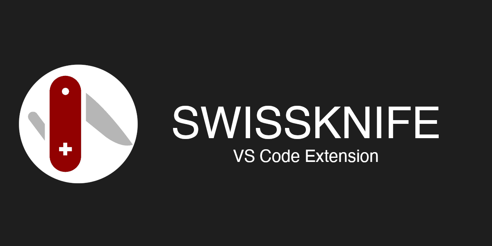
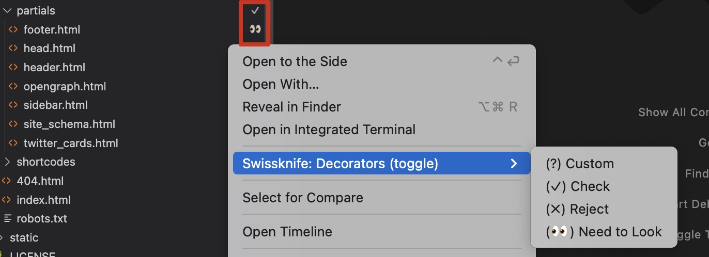

# Swissknife

Available in the [Visual Studio Marketplace](https://marketplace.visualstudio.com/items?itemName=luisfontes19.vscode-swissknife)



Swissknife is the developers' toolbox. It provides a set of features (scripts) to convert data in the editor, like converting to hex, base64 or to generate new data like current timestamps or random strings, etc. 

## Main Features

* Generators and converters available in the form of scripts
* Extendable with custom scripts
* Local webserver with request logging
* File Explorer decorators (and custom decorators)


## Some of the available scripts
|                             |                            |                                         |
| --------------------------- | -------------------------- | --------------------------------------- |
| RGB(a) To Hex               | Hex to RGB                 | Count words                             |
| Count characters            | Md5 hash                   | SHA1 hash                               |
| SHA256 hash                 | SHA512 hash                | Bip39 Mnemonic                          |
| RSA Key pair                | Self Signed Certificate    | Identify hash                           |
| To Morse code               | Unicode decode             | Unicode encode (js format)              |
| Base64 encode               | Base64 decode              | Hex decode                              |
| Hex encode                  | Quoted Printable Decode    | Url Encode                              |
| Url Encode (All Characters) | Url Decode                 | HTML Encode (ALL)                       |
| Text To Binary              | Binary To Text             | UUIDv4                                  |
| Random String               | CSV to Markdown            | Markdown to HTML                        |
| New Swissknife Script (JS)  | New Swissknife Script (TS) | Password strength                       |
| Generate Password           | To Lower Case              | To Upper Case                           |
| Capitalize                  | To Camel Case              | Join lines                              |
| Sort Lines                  | Date to Timestamp          | Timestamp to Date                       |
| UTC DateTime                | Local DateTime             | JWT Decode                              |
| Request to fetch            | Lorem Ipsum                | Unix/Linux Permission To Human Readable |
| Url Shorten                 | Url Unshorten (url expand) | Text to String                          |
| Start Local HTTP Server     | Start Local HTTPS Server   | Stop HTTP Server                        |
| Pick random                 | JSON to YAML               | YAML to JSON                            |


## Usage

You can invoke the dedicated command pallete with ```ctrl+shift+9``` for windows or ```cmd+shift+9``` for mac (when focusing the editor)

The conversions will only use the selected text by default. If no text is selected the entire content of the editor will be used.
It supports multi selection and will run the script for each selection individually

On top of the scripts provided swissknife now offers two new features:

* **Copy relative file path with line number** - right click on a line in the editor and select "Copy file path with line". Ex output: app/src/android/java/com/myorg/app/ui/File.kt#83
* **Ability to check/uncheck files/folders in the explorer**. Right click on a file and select "Toggle: Check File" or "Toggle: Check Folder". A '✓' will show up, identifying that you checked the file/folder

### Macbook Touchbar Support

You can also invoke the swissknife extension directly from the macbook's touchbar

## Scripts Details

### Identify Hash

The outcome of the operation may return multiple values, as a hashes from different algorithms have the same output format.
Still we organize the hashes from top down by most relevant.

### HTTP(S) Server

The servers log all requests received into the "Output" window of VSCode (You can show it by going to view -> Output in the menu). Then on the right of the window (where usually has the value "Tasks"), filter by "Swissknife Server"

## Privacy Note

One of the main purposes of this extension is to stop pasting data, or trusting generated data from random websites.
The extension avoids doing external web requests or logging data, for privacy.
But there are some operations where external requests are needed:

* **Url Unshorten** - This one really needs to do the request to the short url, so it can get the redirect (full) url. But keep in mind that the full url is never reached, the extension does not follow the redirect.

## Writing Scripts

You can quite easily create your own scripts, without the need to dig through the code of the extension. Just create a file and drop it in the "Scripts" folder.

Check how to do it [here](https://github.com/luisfontes19/vscode-swissknife/blob/master/data/custom_scripts.md)

## Decorators

You can use decorators to identify files in the explorer. You can create custom decorators and guess what, emojis are allowed. You can copy them from [here](https://emojipedia.org/). 

Due to a limitation in vscode extension system AFAIK, I can't allow users to extend the menu with their own decorators, so you always need to go through the "Custom" option to use other decorators



## Future Plans

* ~~Create unit tests, specially for the scripts~~
* Start doing proper error handlings
* Create a place for user contributed scripts
